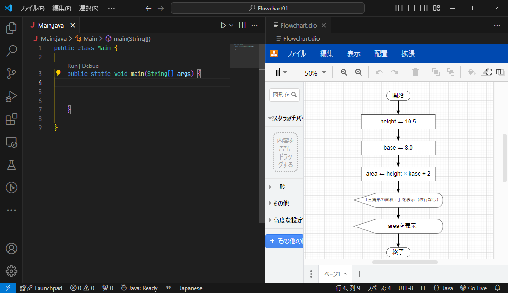

# フローチャート練習 #1
[Flowchart.dio](./Flowchart.dio)の通りに、三角形の面積を計算するプログラムを作ってください。

## 作業のコツ
フローチャートを見ながら編集すると効率的になります。**エディタのタブ**をドラッグ&ドロップして、**左右に表示**されるようにしましょう。


## 実行例
プログラムが完成すると、次の実行結果が表示されます。

```
三角形の面積：42.0
```